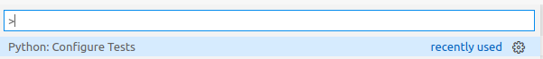
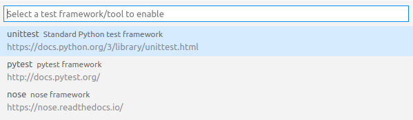
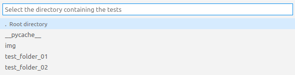
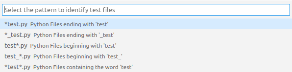

# Start
Dependendo da framework de teste que você for utilizar, você deve seguir os padrões daquela framework.  
Muitos destes padrões são configuráveis mas é bom ler alguns exemplos do que é necessário configurar.  

# Filename
É necessário seguir o padrão de nome de arquivos definidos durante a configuração, exemplo:  
- `test_*.py`
    - Nome do arquivo começando com "test_"
- `*_test.py`
    - Nome do arquivo terminando com "_test"
- `test*.py`
    - Nome do arquivo começando com "test"
- `*test.py`
    - Nome do arquivo terminando com "test"
- `*test*.py`
    - Nome do arquivo possuindo "test" em qualquer parte dele

# Folder
Durante a configuração você escolhe a pasta raiz de testes.  
Todos os arquivos que seguem o padrão de nome definido como teste vão ser coletados.  
Os testes em subpastas da pasta raiz **não** seram coletados automaticamente, é preciso criar um arquivo chamado `__init__.py` na pasta para que os testes dela sejam coletados.  

```yaml
- root_folder
    - test_01.py
    - test_02.py
    - subfolder_01
        - __init__.py
        - test_03.py
        - test_04.py
        - subfolder_02
            - __init__.py
            - test_05.py
```

# Class
O nome da classe é indiferente mas é importante ela herda da classe `TestCase`.  

```python
import unittest

class TestExample01(unittest.TestCase):
    pass
```

# Method
Qualquer método que comece com "test" será interpretado como método de teste.  
Métodos de teste seram executados pela framework.  

```python
import unittest

class TestExample01(unittest.TestCase):
    def test_example_01(self):
        pass
```

# Configuring VSCode
Considerando que você seguiu os padrões da framework, basta utilizar ctrl+shift+p e buscar `Python: Configure Tests`  
  

Selecionar a framework a ser utilizada, no meu caso unittest.  
  

A pasta raiz dos testes (essa página não precisa do `__init__.py` porém subpastas dela iram precisar).  
  

O padrão para nome dos arquivos.  
  

Talvez seja preciso reniciar o VSCode para que as mudanças estejam em dia.  
